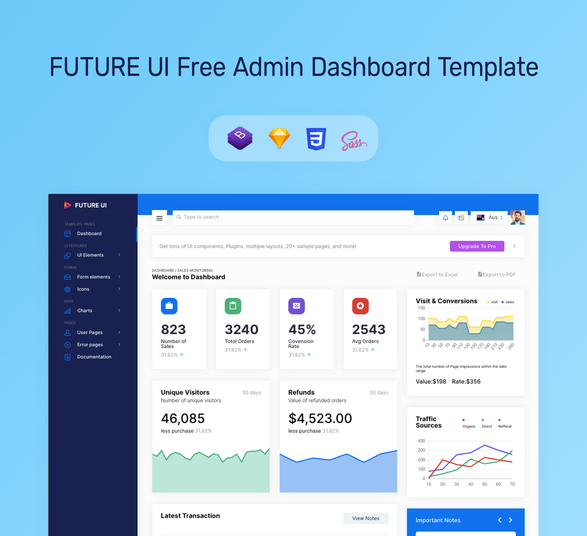

# Future UI - Free Bootstrap Template

Designed based on Bootstrap 4, Future UI serves as the perfect starting point when working on different web app development projects. It is rich in components and features that will help beginners build complex and sophisticated web applications with ease. It is also incredibly flexible and can be easily customized to suit different project requirements.

This free Bootstrap template comes with an MIT license, which means you can use it on any project, for free. Future UI template boasts a fine collection of UI elements, widgets, charts, tables, etc. The premium version has even more features and pages. Be sure to check out our premium [Bootstrap UI kit ](https://www.bootstrapdash.com/product/future-ui/) as well.

<h1>Demo</h1>
Click below to check out the live demo.

## Documentation
Click [here](https://bootstrapdash.com/demo/futureui-free/docs/documentation.html) to check out the documentation

### Need support?
Report your issues with as many details as you can provide and we’ll try to get back to you as soon as possible.

### More from BootstrapDash
Here are some of our most popular templates:

- [StarAdmin Free Bootstrap Admin Template](https://github.com/BootstrapDash/StarAdmin-Free-Bootstrap-Admin-Template)
- [PurpleAdmin Free Admin Template](https://github.com/BootstrapDash/PurpleAdmin-Free-Admin-Template)
- [MajesticAdmin Free Bootstrap Admin Template](https://github.com/BootstrapDash/MajesticAdmin-Free-Bootstrap-Admin-Template)
  
### Like what you see?
Please leave a star on our GitHub repo.
Submit bugs and help us improve Corona Angular!
Find us on 
- [Twitter](https://twitter.com/bootstrapdash?lang=en), 
- [Facebook](https://www.facebook.com/bootstrapdash/), 
- [Instagram](https://www.instagram.com/bootstrapdash/?hl=en),
- [Behance](https://www.behance.net/bootstrapdash),
- [Pinterest](https://www.pinterest.com/bootstrapdash/),
- [Dribbble](https://dribbble.com/bootstrapdash),
- [LinkedIn](https://in.linkedin.com/in/bootstrapdash)

Meticulously built at BootstrapDash. We hope you ❤ Future UI!

#### Credits:

- Bootstrap 4
  
- Font Awesome
  
- jQuery
  
- Gulp
  
- Chart.js
  
- Google Maps
  
- Perfect Scrollbar

#### Browser Support:

- Chrome (latest)
  
- FireFox (latest)
  
- Safari (latest)

- Opera (latest)

- IE10+

#### License Information:

Future UI is released under MIT license. Future UI is a free Bootstrap 4 admin template developed from BootstrapDash. Feel free to download it, use it, share it, get creative with it.

#### How to use Future UI?

- Install node-gyp package. If you don’t know the installation steps, please click [here](https://github.com/nodejs/node-gyp)

- Click the Clone or Download button in GitHub and download as a ZIP file or you can enter the command git clone https://github.com/BootstrapDash/futureui-free-admin-bootstrap-template.git in your terminal to get a copy of this template.
  
-  After the files have been downloaded you will get a folder with all the required files

-   Open your terminal (Run as Administrator). You can install all the dependencies in the template by running the command npm install. All the required files are in the node modules. If you didn't run with admin authorities, you can see errors.
  
- Find the file named index.html, check what components you need. Open the file in a text editor and you can start editing.

-  Now that your project has now kick-started, all you need to do now is to code, code, and code to your heart's content.

#### How to Contribute?:

We love your contributions and we welcome them wholeheartedly. We believe the more the merrier. To contribute make sure you have Node.js and npm installed. Now run the command gulp --version. If the command returns with the Gulp version number, it means you have Gulp installed. If not you need to run the command npm install --global gulp-cli to install Gulp.

#### Next

After Gulp has been installed, follow the steps below to contribute.

- Fork and clone the repo.
  
- Run the command npm install to install all the dependencies.
  
- Enter the command gulp serve. This will open Future UI in your default browser.
  
- Make your valuable contribution.
  
- Submit a pull request.

#### Go Premium!!

Do you need a template with more features and functionalities? Get more with our collection of premium templates with more plugins, eye-catching animations, UI components, and sample pages all fitting together with a high-quality design. Visit [https://www.bootstrapdash.com](https://www.bootstrapdash.com/) for more admin templates.